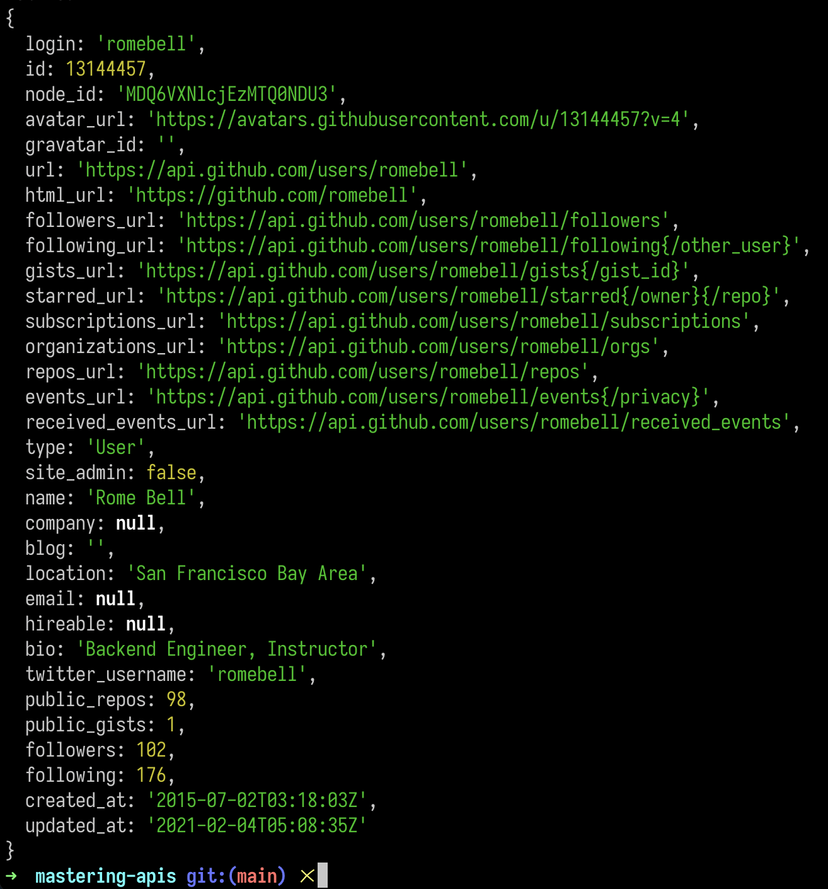
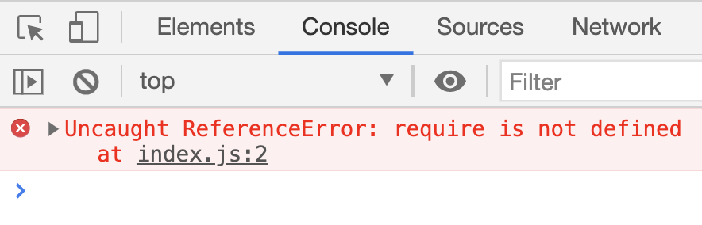

# Mastering APIs
This is me mastering APIs

What the heck a API?
- Application Programming Interface

Here is my example how to make a request

```js
// Requests to a third party database that returns a json object
fetch('https://api.github.com/users/romebell') // endpoint
.then(response => {
    return response.json(); // change this reponse so we can work with it in JavaScript
})
.then(data => {
    console.log(data);
});
```

RESPONSE

### In the Terminal


### The Object in Code
```js
{
  login: 'romebell',
  id: 13144457,
  node_id: 'MDQ6VXNlcjEzMTQ0NDU3',
  avatar_url: 'https://avatars.githubusercontent.com/u/13144457?v=4',
  gravatar_id: '',
  url: 'https://api.github.com/users/romebell',
  html_url: 'https://github.com/romebell',
  followers_url: 'https://api.github.com/users/romebell/followers',
  following_url: 'https://api.github.com/users/romebell/following{/other_user}',
  gists_url: 'https://api.github.com/users/romebell/gists{/gist_id}',
  starred_url: 'https://api.github.com/users/romebell/starred{/owner}{/repo}',
  subscriptions_url: 'https://api.github.com/users/romebell/subscriptions',
  organizations_url: 'https://api.github.com/users/romebell/orgs',
  repos_url: 'https://api.github.com/users/romebell/repos',
  events_url: 'https://api.github.com/users/romebell/events{/privacy}',
  received_events_url: 'https://api.github.com/users/romebell/received_events',
  type: 'User',
  site_admin: false,
  name: 'Rome Bell',
  company: null,
  blog: '',
  location: 'San Francisco Bay Area',
  email: null,
  hireable: null,
  bio: 'Backend Engineer, Instructor',
  twitter_username: 'romebell',
  public_repos: 98,
  public_gists: 1,
  followers: 102,
  following: 176,
  created_at: '2015-07-02T03:18:03Z',
  updated_at: '2021-02-04T05:08:35Z'
}
```

## `require` only works in Node 

```js
const fetch = require('node-fetch'); // only works in NODE
```

What happens when you try to use `require` on the browser
